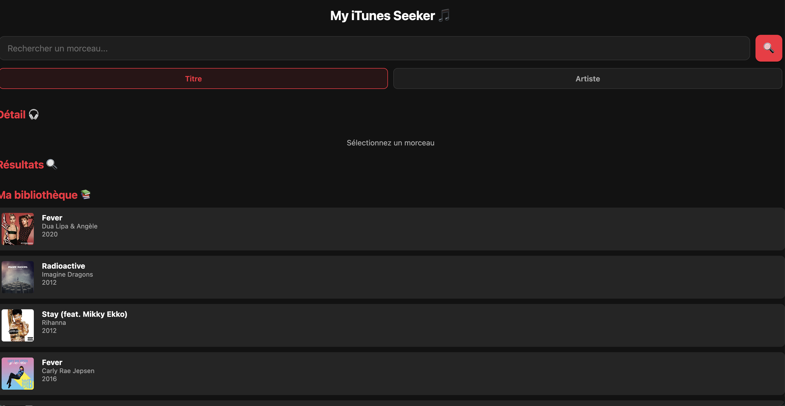

# 🎵 iTunes Seeker

Un explorateur de musique moderne utilisant l'API publique d'iTunes. Cette application permet de rechercher des morceaux ou des artistes, d'écouter des extraits, et de gérer sa propre bibliothèque locale avec un système de notation personnalisé.

## ✨ Fonctionnalités

- **Recherche Avancée** : Filtrez vos recherches par nom de morceau ou par artiste via l'API iTunes.
- **Lecteur Audio intégré** : Écoutez un extrait de 30 secondes pour chaque titre sélectionné.
- **Gestion de Bibliothèque** : Ajoutez vos morceaux favoris à une liste persistante.
- **Système de Notation** : Attribuez une note de 1 à 5 étoiles à vos morceaux sauvegardés.
- **Persistance des données** : Votre bibliothèque est sauvegardée automatiquement dans le `localStorage` de votre navigateur.
- **Interface Moderne** : Design "Dark Mode" inspiré d'Apple Music avec colonnes de défilement indépendantes.

## 🚀 Installation et Lancement

1. **Cloner le projet**
   ```bash
   git clone https://github.com/KhadijaMomar/projet-itunes-react.git
   cd itunes-seeker
   ```
2. **Installer les dépendances**
```bash
  npm install
   ```

3. **Lancer l'application**
```bash
npm start
   ```

## 📂 Structure du Projet

├── src/
│   ├── components/       # Composants UI (SearchBar, Results, Library, etc.)
│   ├── services/         # Logique d'appel à l'API iTunes
│   ├── App.css           # Styles globaux et variables Dark Mode
├── App.js                # Composant principal (gestion d'état)
└── README.md

## 🛠️ Technologies utilisées

React.js : Framework principal pour l'interface.

iTunes Search API : Source des données musicales.

CSS3 (Variables & Grid) : Pour le design responsive et le mode sombre.

LocalStorage API : Pour la sauvegarde des données utilisateur sans base de données externe.

## Utilisation

1 - Saisissez un nom d'artiste (ex: Daft Punk) ou un titre (ex: Blinding Lights) dans la barre de recherche.

2 - Cliquez sur un résultat pour afficher ses détails (pochette HD, lecteur, année).

3 - Cliquez sur "Ajouter à ma bibliothèque" pour le sauvegarder.

4 - Dans la colonne de droite, attribuez vos étoiles pour classer vos morceaux préférés !


Voici un fichier README.md complet et professionnel, structuré pour présenter ton projet iTunes Seeker de manière claire. Tu peux le copier-coller tel quel.
Markdown

# 🎵 iTunes Seeker

Un explorateur de musique moderne utilisant l'API publique d'iTunes. Cette application permet de rechercher des morceaux ou des artistes, d'écouter des extraits, et de gérer sa propre bibliothèque locale avec un système de notation personnalisé.

## ✨ Fonctionnalités

- **Recherche Avancée** : Filtrez vos recherches par nom de morceau ou par artiste via l'API iTunes.
- **Lecteur Audio intégré** : Écoutez un extrait de 30 secondes pour chaque titre sélectionné.
- **Gestion de Bibliothèque** : Ajoutez vos morceaux favoris à une liste persistante.
- **Système de Notation** : Attribuez une note de 1 à 5 étoiles à vos morceaux sauvegardés.
- **Persistance des données** : Votre bibliothèque est sauvegardée automatiquement dans le `localStorage` de votre navigateur.
- **Interface Moderne** : Design "Dark Mode" inspiré d'Apple Music avec colonnes de défilement indépendantes.

## 🚀 Installation et Lancement

1. **Cloner le projet**
  
   git clone https://github.com/KhadijaMomar/projet-itunes-react.git
   cd projet-itunes-react

 
2. **Installer les dépendances**
 
    npm install

2. **Lancer l'application**
 npm start

## 📂 Structure du Projet

L'architecture est organisée pour séparer la logique de données de l'interface utilisateur :
Plaintext
```
├── assets/                
├── src/
│   ├── components/         # Composants d'interface (UI) natifs
│   │   ├── Detail.js       # Affichage complet, lecture audio (expo-av) et notation
│   │   ├── Library.js      # Liste des morceaux sauvegardés par l'utilisateur
│   │   ├── Rating.js       # Système d'étoiles interactif (TouchableOpacity)
│   │   ├── ResultsList.js  # Liste de rendu pour les résultats de recherche
│   │   ├── SearchBar.js    # Champ de saisie et sélecteur Titre/Artiste
│   │   └── TrackItem.js    # Carte individuelle d'un morceau (Ligne de liste)
│   │
│   └── services/           # Logique de données
│       └── itunesApi.js    # Appels fetch vers l'API iTunes et formatage des données
│
├── App.js                  # Point d'entrée : Gestion des états globaux et Layout
├── app.json                # Configuration Expo (nom, version, icône)
├── package.json            # Dépendances (expo-av, async-storage, react-native, etc.)
└── README.md               # Documentation du projet
```
## 🛠️ Technologies utilisées

    React.js : Framework principal pour l'interface.

    iTunes Search API : Source des données musicales.

    CSS3 (Variables & Grid) : Pour le design responsive et le mode sombre.

    LocalStorage API : Pour la sauvegarde des données utilisateur sans base de données externe.

## 📝 Utilisation

    Saisissez un nom d'artiste (ex: Daft Punk) ou un titre (ex: Blinding Lights) dans la barre de recherche.

    Cliquez sur un résultat pour afficher ses détails (pochette HD, lecteur, année).

    Cliquez sur "Ajouter à ma bibliothèque" pour le sauvegarder.

    Dans la colonne de droite, attribuez vos étoiles pour classer vos morceaux préférés !

Développé avec passion par [Ton Nom/Pseudo] dans le cadre d'un exercice d'intégration API.


---

